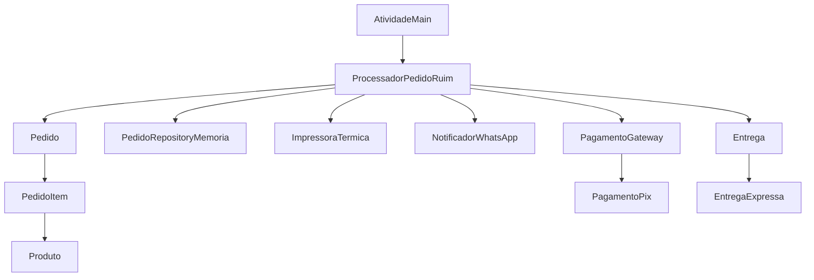
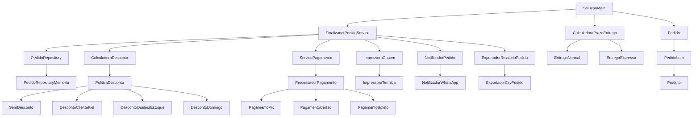

# Atividade - Refatoração SOLID (Feira Livre)

## Contexto

Você recebeu um sistema de pedidos de feira livre que funciona, mas tem problemas de projeto.
O objetivo é refatorar **por princípio SOLID**, mantendo o fluxo funcional.

Fluxo que deve continuar funcionando:

1. Criar pedido
2. Adicionar itens
3. Finalizar com desconto e pagamento
4. Salvar, imprimir e notificar

## Visão inicial (antes da refatoração)



## Regra da atividade

- Não altere o pacote original `feira.problemasolid`.
- Crie a refatoração em `feira.solucao`.
- Execute e valide **uma etapa por vez**, seguindo a ordem dos princípios.

---

## Etapa 0 - Diagnóstico inicial

### Objetivo

Entender os problemas antes de refatorar.

### Classes para analisar

- `src/feira/problemasolid/AtividadeMain.java`
- `src/feira/problemasolid/ProcessadorPedidoRuim.java`
- `src/feira/problemasolid/PagamentoGateway.java`
- `src/feira/problemasolid/PagamentoPix.java`
- `src/feira/problemasolid/Entrega.java`
- `src/feira/problemasolid/EntregaExpressa.java`

### Evidência esperada

- Lista curta dos problemas encontrados em SRP, OCP, ISP, DIP e LSP.

---

## Etapa 1 - SRP (Single Responsibility Principle)

### Problema (SRP)

`ProcessadorPedidoRuim` concentra responsabilidades demais.

### Classes existentes (origem do problema - SRP)

- `src/feira/problemasolid/ProcessadorPedidoRuim.java`

### Classes a criar (solução - SRP)

- `src/feira/solucao/service/FinalizadorPedidoService.java`
- `src/feira/solucao/repository/PedidoRepository.java`
- `src/feira/solucao/repository/PedidoRepositoryMemoria.java`
- `src/feira/solucao/cupom/ImpressoraCupom.java`
- `src/feira/solucao/cupom/ImpressoraTermica.java`
- `src/feira/solucao/notificacao/NotificadorPedido.java`
- `src/feira/solucao/notificacao/NotificadorWhatsApp.java`
- `src/feira/solucao/relatorio/ExportadorRelatorioPedido.java`
- `src/feira/solucao/relatorio/ExportadorCsvPedido.java`

### Como executar esta etapa (SRP)

1. Extraia persistência para repositório.
2. Extraia impressão para `ImpressoraCupom`.
3. Extraia notificação para `NotificadorPedido`.
4. Extraia exportação para `ExportadorRelatorioPedido`.
5. Deixe `FinalizadorPedidoService` apenas orquestrando.

### Validação da etapa (SRP)

- Alterar impressão não afeta pagamento.
- Alterar notificação não afeta cálculo.

---

## Etapa 2 - OCP (Open/Closed Principle)

### Problema (OCP)

Desconto e pagamento usam `if/else` central, exigindo edição do orquestrador para cada novo tipo.

### Classes existentes (origem do problema - OCP)

- `src/feira/problemasolid/ProcessadorPedidoRuim.java`

### Classes a criar (solução - OCP)

- `src/feira/solucao/desconto/PoliticaDesconto.java`
- `src/feira/solucao/desconto/SemDesconto.java`
- `src/feira/solucao/desconto/DescontoClienteFiel.java`
- `src/feira/solucao/desconto/DescontoQueimaEstoque.java`
- `src/feira/solucao/desconto/DescontoDomingo.java`
- `src/feira/solucao/desconto/CalculadoraDesconto.java`
- `src/feira/solucao/pagamento/ProcessadorPagamento.java`
- `src/feira/solucao/pagamento/PagamentoPix.java`
- `src/feira/solucao/pagamento/PagamentoCartao.java`
- `src/feira/solucao/pagamento/PagamentoBoleto.java`
- `src/feira/solucao/pagamento/ServicoPagamento.java`

### Como executar esta etapa (OCP)

1. Criar estratégia para desconto (`PoliticaDesconto`).
2. Criar uma classe para cada tipo de desconto.
3. Criar serviço que resolve desconto por código.
4. Repetir o mesmo padrão para pagamento.
5. Remover `if/else` de desconto/pagamento do orquestrador.

### Validação da etapa (OCP)

- Adicionar novo desconto sem editar `FinalizadorPedidoService`.
- Adicionar novo pagamento sem editar `FinalizadorPedidoService`.

---

## Etapa 3 - ISP (Interface Segregation Principle)

### Problema (ISP)

Interface grande força implementações a ter métodos que não usam.

### Classes existentes (origem do problema - ISP)

- `src/feira/problemasolid/PagamentoGateway.java`
- `src/feira/problemasolid/PagamentoPix.java`

### Classes a criar/ajustar (solução - ISP)

- `src/feira/solucao/pagamento/ProcessadorPagamento.java`
- `src/feira/solucao/pagamento/PagamentoPix.java`
- `src/feira/solucao/pagamento/PagamentoCartao.java`
- `src/feira/solucao/pagamento/PagamentoBoleto.java`

### Como executar esta etapa (ISP)

1. Definir interface mínima para o caso de uso: `codigo()` e `pagar(valor)`.
2. Implementar cada classe de pagamento somente com o que precisa.
3. Garantir que não exista método “não suportado” por design.

### Validação da etapa (ISP)

- Não há `UnsupportedOperationException` causado por interface mal desenhada.

---

## Etapa 4 - DIP (Dependency Inversion Principle)

### Problema (DIP)

Classe de alto nível depende de classes concretas e instancia tudo com `new`.

### Classes existentes (origem do problema - DIP)

- `src/feira/problemasolid/ProcessadorPedidoRuim.java`

### Classes a ajustar (solução - DIP)

- `src/feira/solucao/service/FinalizadorPedidoService.java`
- `src/feira/solucao/SolucaoMain.java`

### Como executar esta etapa (DIP)

1. Em `FinalizadorPedidoService`, declarar dependências por interface.
2. Receber tudo por construtor.
3. Mover a criação das implementações para `SolucaoMain`.

### Validação da etapa (DIP)

- Troca de implementação sem alterar `FinalizadorPedidoService`.

---

## Etapa 5 - LSP (Liskov Substitution Principle)

### Problema (LSP)

Subtipo de entrega quebra o comportamento esperado do tipo base.

### Classes existentes (origem do problema - LSP)

- `src/feira/problemasolid/Entrega.java`
- `src/feira/problemasolid/EntregaExpressa.java`

### Classes a criar (solução - LSP)

- `src/feira/solucao/entrega/CalculadoraPrazoEntrega.java`
- `src/feira/solucao/entrega/EntregaNormal.java`
- `src/feira/solucao/entrega/EntregaExpressa.java`

### Como executar esta etapa (LSP)

1. Definir contrato único de cálculo de prazo.
2. Fazer as implementações respeitarem o mesmo domínio de entrada.
3. Usar ambas no mesmo ponto do código, sem tratamento especial.

### Validação da etapa (LSP)

- `EntregaNormal` e `EntregaExpressa` funcionam de forma intercambiável.

---

## Classe principal da solução

### Classe a criar

- `src/feira/solucao/SolucaoMain.java`

### Papel da classe

- Montar as implementações (injeção de dependência).
- Criar pedido de exemplo.
- Chamar `FinalizadorPedidoService`.
- Demonstrar cálculo de prazo com entrega normal e expressa.

## Diagrama final (depois dos ajustes)



Leitura do diagrama final:

- `SolucaoMain` monta as dependências (injeção).
- `FinalizadorPedidoService` depende de **abstrações**, não de concretos.
- Desconto e pagamento seguem estratégia (extensível sem mexer no orquestrador).
- Entrega usa contrato único (`CalculadoraPrazoEntrega`) com implementações intercambiáveis.

---

## Ordem de execução recomendada (em aula)

1. Etapa 0 (diagnóstico)
2. Etapa 1 (SRP)
3. Etapa 2 (OCP)
4. Etapa 3 (ISP)
5. Etapa 4 (DIP)
6. Etapa 5 (LSP)
7. `SolucaoMain` e validação final

---

## Comandos para compilar e executar

No PowerShell, dentro de `atividade-solid-feira-livre-java`:

```powershell
javac -d out (Get-ChildItem -Path src -Recurse -Filter *.java | ForEach-Object { $_.FullName })
java -cp out feira.solucao.SolucaoMain
```

## Entrega da equipe (obrigatória)

A equipe deve entregar a atividade em um **repositório Git da equipe**.

### O que deve existir no repositório

- Código original (`feira.problemasolid`) preservado.
- Solução em `src/feira/solucao/`.
- Este roteiro `ATIVIDADE.md`.
- `README.md` atualizado com instruções de execução.

### Organização mínima de commits

- Pelo menos 1 commit por etapa principal:
  - SRP
  - OCP
  - ISP
  - DIP
  - LSP

### Informações da entrega

- Link do repositório da equipe.
- Nomes completos dos integrantes no `README.md`.
- Identificação da turma no `README.md`.

## Checklist final

- [ ] Refatoração feita em `feira.solucao`.
- [ ] Cada princípio aplicado na sua etapa.
- [ ] Sem `if/else` central para desconto/pagamento no orquestrador.
- [ ] Sem `UnsupportedOperationException` por design.
- [ ] Dependências injetadas por abstrações.
- [ ] Substituição de entrega funcionando sem quebra.
- [ ] Projeto compila e executa.
- [ ] Ajuste entregue em repositório Git da equipe.
